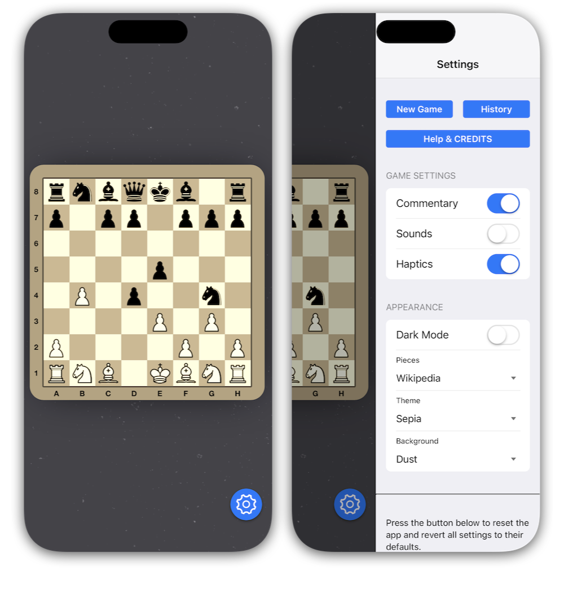

# What is enClose?


enClose is an iOS and MacOS hybrid application development framework that enables developers to use familiar web technologies (JavaScript, HTML, and CSS) to build rich applications that perform like native apps.

### Documentation
You can find complete documentation and sample code here: [enClose.app](https://www.eclose.app).

### Core Concept

enClose streamlines app development by allowing developers to leverage both the power of native Swift code and the flexibility of web technologies. Unlike traditional hybrid frameworks with predefined APIs or plugin systems, enClose removes restrictions, giving developers complete freedom to build any app they envision.

### Key Features

The framework facilitates seamless interaction between native functions and JavaScript within your application. It enables:
- Invoking native Swift functions from your JavaScript app
- Calling JavaScript functions from the native components of your application

### Why Choose enClose?

Unlike Cordova, which can be limiting and complex, enClose offers a refreshing alternative. It doesn't confine you to a predefined set of functions via an API; instead, it enables you to tap into the full potential of the iOS and MacOS platforms.

enClose is designed to be remarkably straightforward and flexible, putting you in control with the freedom to structure your code as you see fit.

### Proven Track Record

enClose has demonstrated its reliability and versatility through years of successful implementation across diverse environments. Since its initial development in 2016, the framework has maintained a strong presence in both enterprise settings and consumer applications:

#### Enterprise Deployment
The framework has powered mission-critical business applications for multiple commercial enterprises, including:

* Comprehensive warehouse management systems
* Enterprise-grade sales and CRM platforms
* Robust point-of-sale solutions for retail environments
* Complete restaurant management system for industrial kitchens

#### Commercial Success
enClose has proven its commercial viability through multiple successful App Store publications. These consumer-facing applications showcase the framework's ability to deliver polished, high-performance experiences that meet Apple's stringent standards for quality and user experience.

This extensive real-world implementation across both B2B and B2C environments demonstrates enClose's maturity, stability, and adaptability as a development framework.

### App Showcase

<a href="https://enclose.app/#showcase"></a>

# Getting Started
enClose functions as a starter project, providing a simple and straightforward installation process. You'll clone the project, customize a few key settings, and use it as the foundation for your application.

## Installation Steps

1. **Clone the Repository**
   ```
   git clone https://github.com/fellowgeek/enClose
   ```

<small>You can also download the project directly from the [releases](https://github.com/fellowgeek/enClose/releases) page on GitHub.</small>

2. **Select Your Platform**
   - Copy the **iOS-Swift** folder for iOS development
   - Copy the **MacOS-Swift** folder for macOS development

3. **Open in Xcode**
   - Launch Xcode
   - Open the project file in your copied folder

4. **Configure Project Settings**
   - Update the app bundle identifier
   - Change the project name to match your application


# Example Project

This sample project demonstrates the versatility and power of the enClose framework for building hybrid iOS applications using web technologies while accessing native device capabilities.

### TV Chess Basic
TV Chess - Basic is a two-player chess application that showcases seamless integration between web-based UI components and native iOS features. The project illustrates how developers can leverage familiar web technologies while still delivering a truly native experience with platform-specific functionality.

Download the project for GitHub: [https://github.com/fellowgeek/tv-chess-basic](https://github.com/fellowgeek/tv-chess-basic)



# Sponsor enClose

Want to support enClose's development? Become a sponsor on Patreon and help us bring innovative iOS hybrid app solutions to life.

[https://patreon.com/enClose](https://patreon.com/enClose)

Thank you for your support!
